<h1>Even Driven architecture  using  spring with kafka</h1>
<p>
Dans ce projet , nous allons concevoir une architecture pilotée par les événements en utilisant Spring Boot et Apache Kafka. L'objectif est de créer une application qui publie et consomme des événements via Kafka, permettant ainsi une communication asynchrone entre différents services.
 pour cela, nous allons nous fixer comme but de créer  faire du  data anlytics  en temps réel ( réal time stream-pocessing ) sur les  informations de  d'interactions et de visites d 'une plattforme  web. 
</p>
<h2>Technologies utilisées</h2>
<Ul>
  <li>Java 17</li>
  <li>Spring Boot</li>
  <li>Apache Kafka</li>
  <li>Spring Kafka</li>
  <li>Zookeeper</li>
  <li>Docker</li>
<li>Maven</li>
</Ul>
<h2> créattion du projet</h2>
<p> Pour commencer le projet nous créer un  projet springboot avec les dépendences suivants : </p>
<Ul>
    <li>Spring Web</li>
    <li>Spring kafka</li>
    <li>Spring kafka streams</li>
    <li>Spring Cloud stream</li>
    <li>Lombok</li>
    <li>Spring Boot DevTools</li>
   </Ul>
<p>
Nous lançons le broker kafka et zookeeper en utilisant   Docker  via DockerDestop. Pour cela , nous disposons  d'un fichier 
docker-compose.yml  qui définit les services zookeeper et  kafka ainsi que leur  configuration.
</p>

[To learn about configuring Kafka for access across networks see](https://www.confluent.io/blog/kafka-client-cannot-connect-to-broker-on-aws-on-docker-etc/)
```yaml
version: '3'
services:
zookeeper:
    image: confluentinc/cp-zookeeper:7.3.0
    container_name: zookeeper
    environment:
      ZOOKEEPER_CLIENT_PORT: 2181
      ZOOKEEPER_TICK_TIME: 2000

broker:
image: confluentinc/cp-kafka:7.3.0
container_name: broker
ports:
- "9092:9092"
depends_on:

- zookeeper
environment:
KAFKA_BROKER_ID: 1
KAFKA_ZOOKEEPER_CONNECT: 'zookeeper:2181'
KAFKA_LISTENER_SECURITY_PROTOCOL_MAP: PLAINTEXT:PLAINTEXT,PLAINTEXT_INTERNAL:PLAINTEXT
KAFKA_ADVERTISED_LISTENERS: PLAINTEXT://localhost:9092,PLAINTEXT_INTERNAL://broker:29092
KAFKA_OFFSETS_TOPIC_REPLICATION_FACTOR: 1
KAFKA_TRANSACTION_STATE_LOG_MIN_ISR: 1
KAFKA_TRANSACTION_STATE_LOG_REPLICATION_FACTOR:
 ```
<p> Lance en suite les conteneur en exécutant la commande :

```Bash
docker-compose up -d
```
</p>

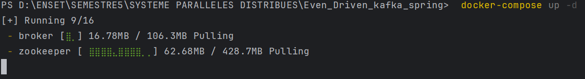
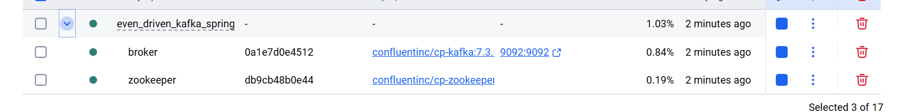


<h2>Implementation de la logique de publicqtion et de la consmmation dess évenements </h2>


<p> Nous avons créer deux package,controller et events  qui  vont contenir respectivements les controller de notre web applcation et les dto
pour l'envoi des  des evenement relatif à toutes les pages. On definit ensuite un dto et pageEvent et  controller pageEventController  pour servir les requette 
</p>

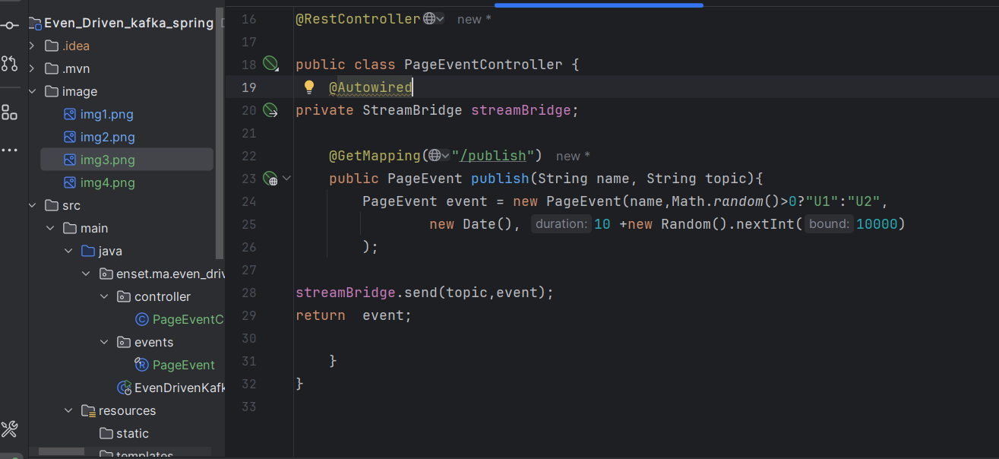
#### Test de l'api de publication des évenements
<p> Nous utilisons un navigateur chrome pour tester : </p>

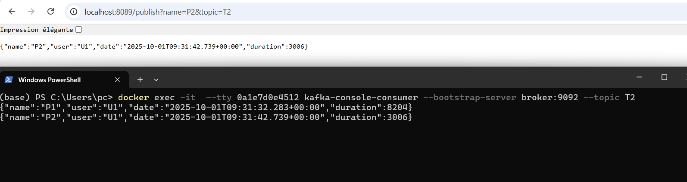
<p> Nous tester le cosummer que nous   avons developpé</p>

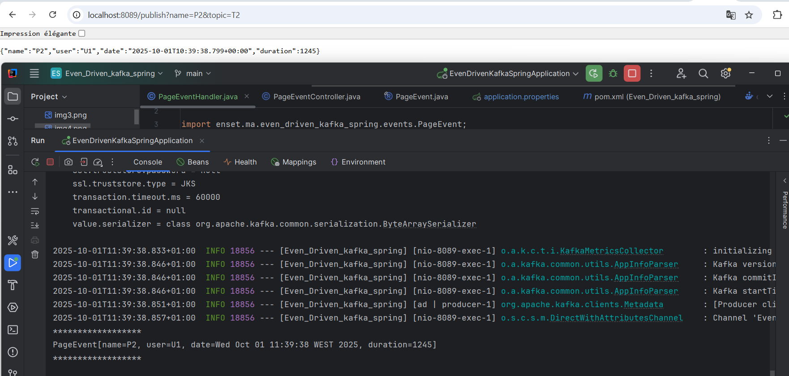

<p> Nous  avons l'execution de notre supplier </p>

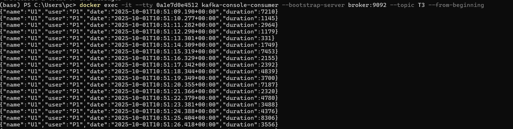

<p> Pour la partie a analytics nous implementons une fonction kstreamFunction qui consomme 
 les messsge qdu supplier dans T3 et fait une publication  dans une autre topic T4</p>

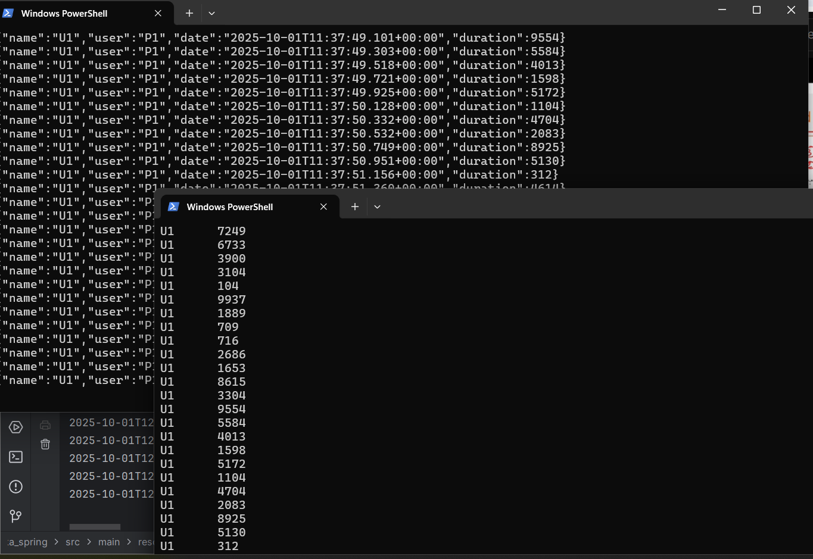
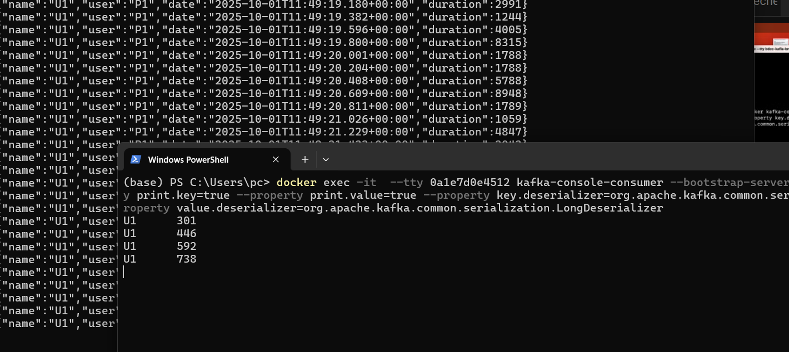
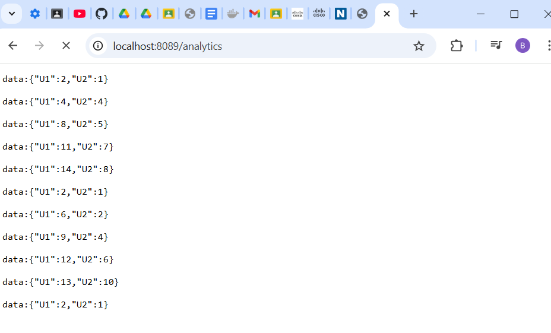

<h2>Affichage du tableau de Bord en realtime</h2>
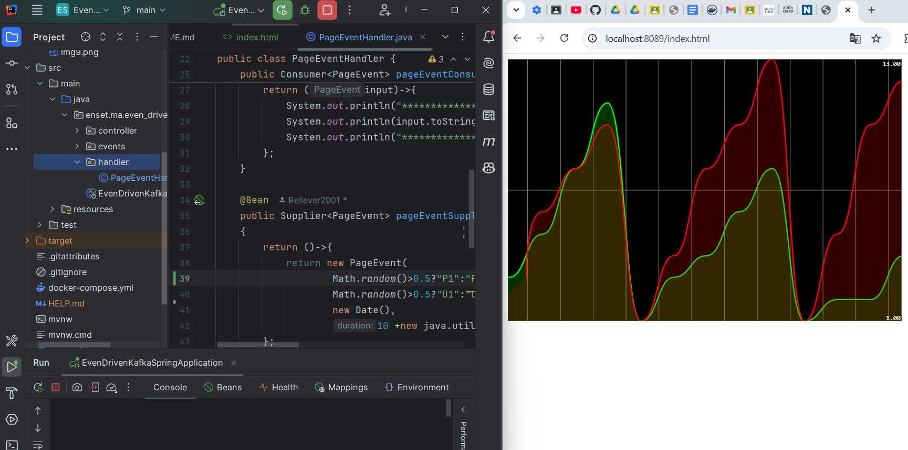
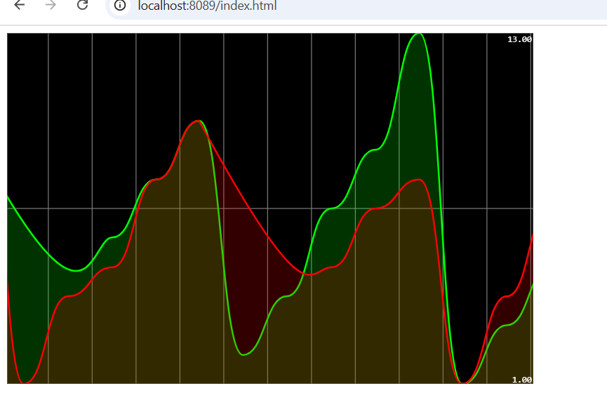

